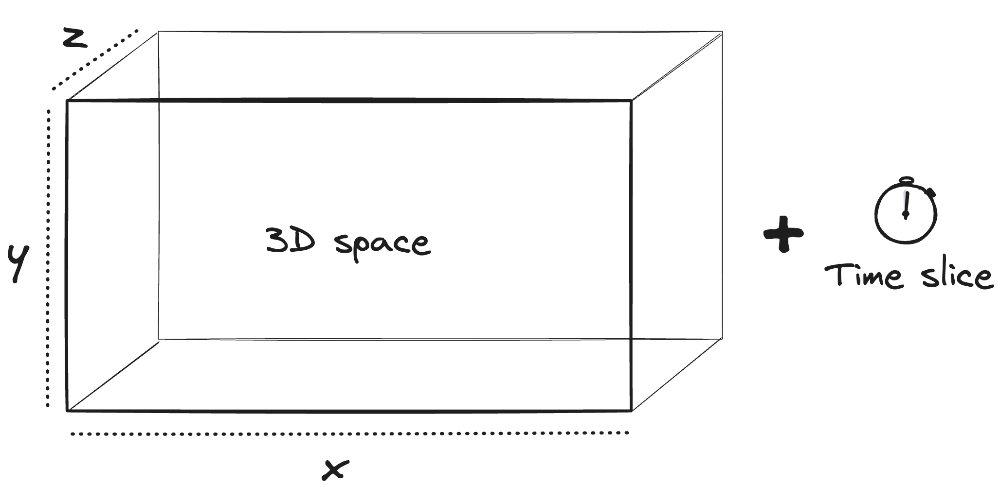
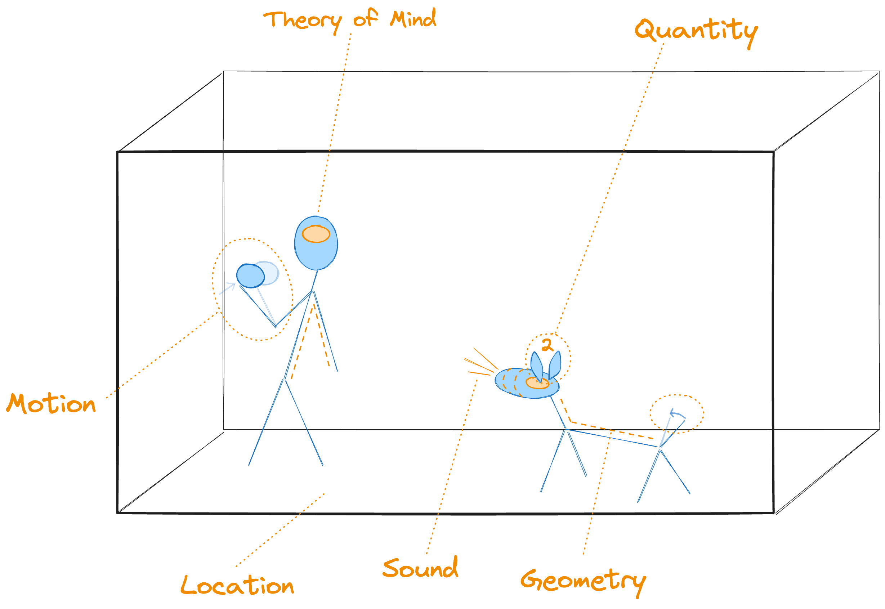
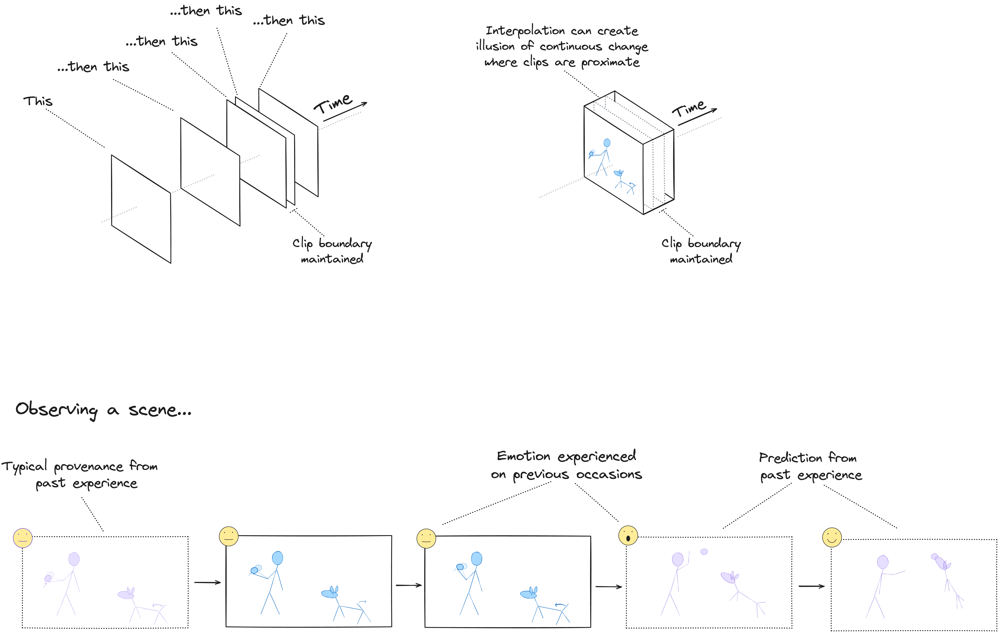
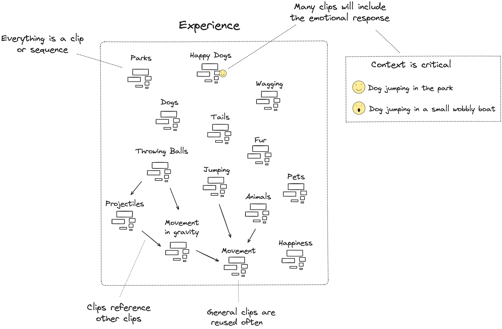
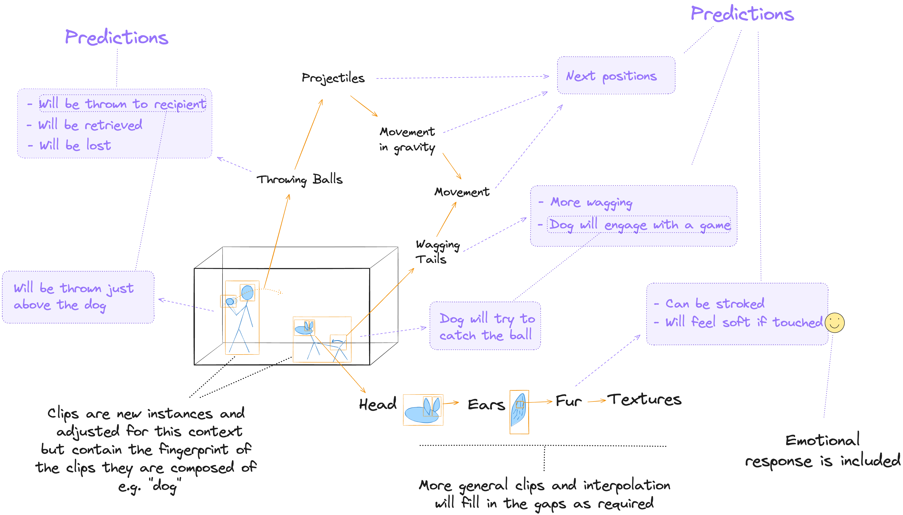
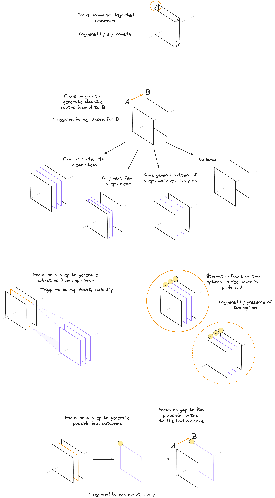

# Illustrated Summary (Draft)

## Core Building Blocks

Cognitive functions in this model will be built entirely from "clips". Clips can be arranged into "sequences".

### Clips

A clip is a representation of 3D space with a small time component so that movement can be represented.

#### Space and Time

#### Ingredients
Clips contain observable phenomena which are represented using particular ingredients. Each ingredient will be handled by a subsystem that specialises in that ingredient, e.g. spatial geometry.

All clips include the emotion of the observer, though this emotion may be neutral.

### Sequences
Clips will be arranged into sequences that depict change over time. This is where temporal concepts such as prediction, causation and provenance will emerge. 

### Composition

#### Clips in Experience

The AI system's experience will include a huge number of sequences that will be used to understand the world and to make plans.

#### Layers of Composition

## The Thinking Process

### Finding a Route

Most, perhaps all, active thinking is the process of finding a route from one location in space and time to another.

This will be achieved by building sequences that represent these routes.

### Thinking Patterns

Some of the many thinking patterns include...

