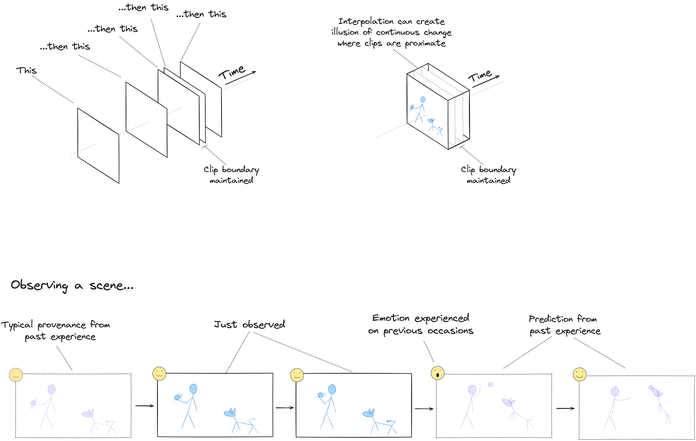

# Illustrated Summary (Draft)

## Core Building Blocks

### Clips

#### Space and Time

#### Ingredients

#### Example

### Sequences

### Composition

#### Clips in Experience

#### Layers of Composition

## Planning

todo

