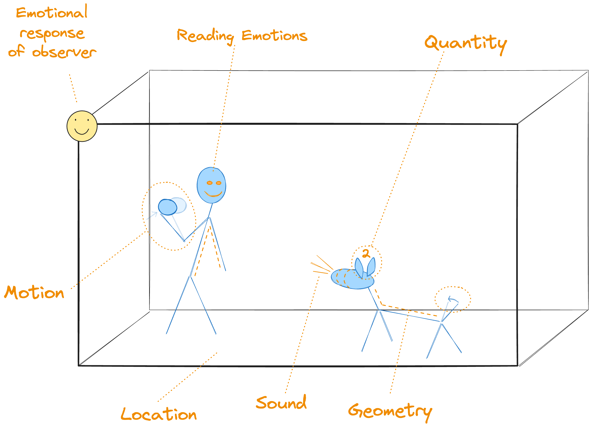
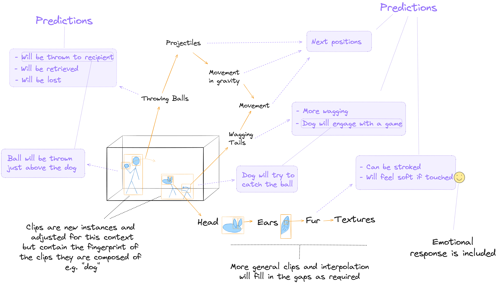

# Illustrated Summary (Draft)

## Core Building Blocks

Cognitive functions in this model will be built entirely from **clips**. Clips can be arranged into **sequences**.

> Note: "Frame" might have been a better word than "clip", but this term is already used in this domain.

### Clips

A clip is a representation of 3D space with a small time component so that movement can be included.

#### Space and Time

#### Ingredients
Clips contain observable phenomena which are represented using particular ingredients. Each ingredient will be handled by a subsystem that specialises in that ingredient, e.g. spatial geometry.

All clips include the emotion of the observer, though this emotion may be neutral.

### Sequences
Clips will be arranged into sequences that depict change over time. This is where temporal concepts such as prediction, causation and provenance will emerge. 

### Physical World Model

The AI system's experience will include a huge number of sequences that will be combined with sensory information to build a model of the physical world using composition.

#### Composition

Clips are composed of other clips. This allows re-use of experiences in multiple settings and vastly reduces the amount of data that needs to be stored.

#### Experience

The AI system's memory will be comprised of clips and sequences that can be matched with sensory data to build a model (i.e. a clip) of the immediate physical surroundings - the "Here and Now".

#### Get-Next-Clip

A "get-next-clip" loop will continually refresh the here-and-now clip. Older clips will be added to a sequence representing what happened previously.

Note: The storage of past events will be covered in more detail when this is expanded to incorporate a full self-narrative later in this summary.

### Actions

If the AI system has a physical body then this will be included in experience. Physical actions such as adjusting visual focus, walking, reaching etc will be predicted just like other phenomena. The body will follow whatever the current prediction is.

todo - catching prediction illustration

### Experiences vs Senses

Most of the physical world model will be build from experiences as this data is pre-processed and rich in predictive value. This may result in a trade-off where clips can incorrectly override sensory information similar to when a human who is used to escalators encounters a stationary escalator - the loaded clip may include movement and the predicted leg motion is likewise designed for a moving surface.

### Summary

At this point the AI system should, in principle, be able to build a human-like model of the environment and perform actions such as focus on an object, manipulate objects, walk, catch a ball and other such actions that don't require advanced planning.

## The Thinking Process

### Finding a Route

Most, perhaps all, active thinking is the process of finding a route from one location in space and time to another.

This will be achieved by building sequences that represent these routes.

### Example 1 - Navigation

This example illustrates some of the thinking patterns that may be used when planning a route between locations. It does not include every step.

### Thoughts as Objects

As can be seen from the example, thinking is a bit like manipulating objects. 

> **This is already handled by clips and sequences so the above process can be placed into our existing framework.**

 

### Thinking History

Thoughts will be recorded as sequences and key elements can be extracted for re-use.

todo - more detail

### Emotional Guidance and AI Safety

#### Purpose of Emotions

Emotions are the steering wheel for decisions. They will have a strong influence on which clip (including thought pattern clips) will be retrieved from experience. This means that they exert their influence for every state change in the system.

#### Illustrative List

Illustrative priming effect of emotions...

* Curiosity - to encourage useful action that is not part of some assigned task.
* Interest - to keep working on something.
* Surprise - to notice significant new information that would benefit from further thought and storage in experience (including new causation / prediction knowledge). 
* Doubt - to pause, consider and temper other emotions present in a plan.
* Compassion and Empathy - to encourage thoughts of safety and kindness.
* Desire - to act or make plans to reach a goal with positive emotions,
* Coherence Desire - to adjust sequences (objects, thoughts etc) so that they flow smoothly.
* Worry - to keep an important matter in mind.
* Urgency - to work faster. May be sub-divided into other types, e.g. fear of missing out.
* Regret - to ponder past actions and build better plans for the future.
* Pride - to create a desire for social approval and for doing a job well.
* Humility - to temper rash confidence.
* Joy, Happiness etc - Counterparts to worry, regret and other negative emotions.

... and many more. Choices will be made by considering the balance of these emotions for a given situation. There may need to be some that are strongly negative (figuratively speaking) so that, for example, extreme suffering cannot be considered an acceptable trade-off for a large number of smaller gains. 

#### Defining Emotions

-  A set of very general exemplar sequences will be defined and these will set the emotional goals of the system. Sequences that pattern-match to these core sequences will inherit these emotions according to the degree of similarity.

- This will likely require delicate calibration. It should be possible to author a large set of more specific scenarios in natural language along with expected emotional responses and / or consequent actions. These would be used for testing the system's motivations, including AI safety.

### Example 2 - Pythagoras

The process of solving a geometry question will require a range of overlapping thought patterns that describe the steps. Our system will return the best matching pattern in any given moment. If this an exam question, then the starting point is the observed question and the desired end point is for an answer to be written in the appropriate location that will receive full marks from the examiner. An additional requirement is that not too much time is spent on this process.

### Thinking Patterns

Some of the many thinking patterns include...

## The Self Narrative - Putting it all Together

todo

