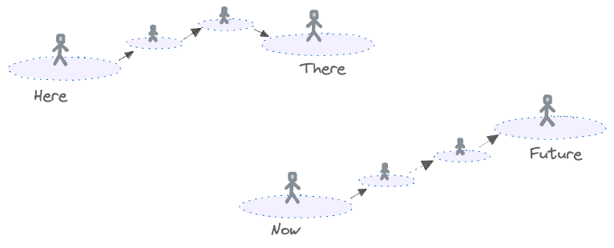

# Illustrated Summary (Draft)

> **Author**: Robert Beckwith
> **Version**: 0.1 - Draft for review

## Key Features

### Starting Assumptions

>Core assumption is that building a human-like thinking system is a worthwhile project principally for alignment, transparency and trust reasons.

>This design uses an architectural principle of minimalism which dictates that no new software components will be invented if needs can be met with existing mechanisms. As the design begins with navigation of the physical world using a physical world model, "existing" generally refers to physical world model mechanisms.

### Reasoning Model
>Thinking and planning capabilities almost entirely reuse the machinery of a physical world model - nothing significantly new is created. This allows thinking to re-use the non-trivial stochastic capabilities of the world model and also to share data with this model. Thoughts are virtual objects that can be generated and assembled into temporal sequences such as a navigation route. This activity follows predictions in much the same way as physical movement via a "get next thought / set subject of focus" loop.

### Steered by Emotions
>The world model includes the emotions/feelings of the observer which effectively assigns a value judgement to experiences. 

>The next action (physically or in thinking) will be determined mainly by the current subject of focus and the currently felt emotion. Recent experiences and the physical-social location will also prime for certain actions.

>Deliberate and effortful thinking (aka System 2) arises when the emotional response to a subject of focus is strong enough to hold focus (i.e. prevent it from wandering on to something else). This focus and combined with the emotion will cause the underlying "get next thought" machinery to load thoughts relevant to this topic, including more complex and memory-intensive thinking patterns.

## Core Building Blocks

Cognitive functions in this model will be built entirely from **clips**. Clips can be arranged into **sequences**.

> Note: "Frame" might have been a better word than "clip", but this term is already used for a different concept in this domain.

### Clips

A clip is a representation of 3D space with a small time component so that movement and sound can be included.

#### Space and Time

#### Ingredients
Clips contain observable phenomena which are represented using particular ingredients. Each ingredient will be handled by a subsystem that specialises in that ingredient, e.g. spatial geometry. 

> Note: The time slice may only be required (if at all) for certain ingredient types e.g sound and motion. Motion itself may be recorded as a vector.

All clips include the emotion (or "feeling") of the observer, though this emotion may be neutral. This includes surprise, curiosity and doubt.

### Sequences
Clips will be arranged into sequences that depict change over time. This is where temporal concepts such as prediction, causation and provenance will emerge. 

### Physical World Model

The AI system's experience will include a huge number of sequences that will be combined with sensory information to build a model of the physical world using composition.

#### Composition

Clips are composed of other clips. This allows re-use of experiences in multiple settings and vastly reduces the amount of data that needs to be stored.

#### Experience

The AI system's memory will be comprised of clips and sequences that can be matched with sensory data to build a model (i.e. a clip) of the immediate physical surroundings - the "Here and Now".

#### Get-Next-Clip

A "get-next-clip" loop will continually refresh the here-and-now clip. Older clips will be added to a sequence representing what happened previously.

Note: The storage of past events will be covered in more detail when this is expanded to incorporate a full self-narrative later in this summary.

### Actions

If the AI system has a physical body then this will be included in experience. Physical actions such as adjusting visual focus, walking, reaching etc will be predicted just like other phenomena. The body will follow whatever the current prediction is.

### Experiences vs Senses

Most of the physical world model will be build from experiences as this data is pre-processed and rich in predictive value. This may result in a trade-off where clips can incorrectly override sensory information. This may be similar to the situation where a human who is used to escalators encounters a stationary escalator - the loaded clip may include movement where there is none and the predicted leg motion is likewise calibrated for a moving surface.

### Summary

>At this point the AI system should, in principle, be able to build a human-like model of the environment and perform actions such as focus on an object, manipulate objects, walk, catch a ball and other such actions that don't require advanced planning.

## The Thinking Process

### Finding a Route

Most, perhaps all, active thinking is the process of finding a route from one location in space and time to another.

This will be achieved by building sequences that represent these routes.

### Example 1 - Navigation

This example illustrates some of the thinking patterns that may be used when planning a route between locations. It does not include every step.

### Thoughts as Objects

As can be seen from the example, thinking is a bit like manipulating objects. 

**This is already handled by clips and sequences so the above process can be placed into our existing framework.**

 

### Thinking History

Thoughts will be recorded as sequences so that key elements can be extracted for re-use. They will be distilled down to the most general and essential pattern so that they can be matched to the current circumstances even if the specifics of the current circumstances are different to previous experience. E.g "in this sort of situation do this sort of thing followed by that sort of thing". The existing flexibility of clips and sequences that is required for understanding the physical world can be re-used for this process.

### Emotional Guidance and AI Safety

#### Purpose of Emotions

Emotions are the steering wheel for decisions. They will have a strong influence on which sequence (including thought patterns) will be retrieved from experience in the next cycle via priming. This means that they exert their influence on every state change in the system allowing fine-grained control.

It this design there is only one place holder for emotions. As emotions are used to assess the subject of focus there will only be one subject of focus at a time and furthermore there will be some optimal scope of this focus. If the scope is too broad then the causes of emotional responses will not be clear.

#### Illustrative List of Emotions

This list is an illustration of the kind of priming that certain possible emotions may have, i.e. what sort of thought patterns and actions are more likely to be retrieved for the next clip in working memory...

* Curiosity - to encourage useful action that is not part of some assigned task.
* Interest - to keep working on something.
* Surprise - to notice significant new information that would benefit from further thought and storage in experience (including new causation / prediction knowledge). 
* Doubt - to pause, consider and to temper other emotions present in a plan.
* Compassion and Empathy - to encourage thoughts of safety and kindness.
* Desire - to act or make plans to reach a goal with positive emotions.
* Coherence Desire - to adjust sequences (objects, thoughts etc) so that they flow smoothly.
* Worry - to keep an important matter in mind.
* Urgency - to work faster. May be sub-divided into other types, e.g. fear of missing out.
* Regret - to ponder past actions and build better plans for the future.
* Pride - to create a desire for social approval and for doing a job well.
* Humility - to temper rash confidence.
* Joy, Happiness etc - Counterparts to worry, regret and other negative emotions.

... and many more. Choices will be made by considering the balance of these emotions for a given situation. There may need to be some that are strongly negative (figuratively speaking) so that, for example, extreme suffering cannot be considered an acceptable trade-off for a large number of smaller gains. 

#### Defining Emotions

-  A set of very general exemplar sequences will be defined and these will set the emotional responses of the system, e.g. various negative emotions for scenarios where a human being is injured. Sequences that pattern-match to these core sequences will inherit these emotions according to the degree of similarity.

- This will likely require delicate calibration. It should be possible to author a large set of more specific scenarios in natural language along with expected emotional responses and / or consequent actions. These would be used for testing the system's motivations, including the AI safety aspects.

### Effortful Thinking

The act of effortful thinking involves holding focus on a thought so that the background get-next-clip loop generates subsequent thoughts that are relevant to that particular target of focus. The emotional guidance system should be balanced such that the cost of this thinking, e.g. time (aka opportunity cost) and power consumption, is balanced with whatever outcome is being sought.

 Most plan-building strategies will involve these key aspects...

 - Recognising some high-level pattern for what needs to be done, which includes realising that there is something that needs to be done.
 - Looking at a part of the plan with various types of priming (e.g. "what could go wrong here?" + worry emotion and "what opportunities are there here?" + curiosity emotion) to see what options arise and then assessing those options. 

### Example 2 - Pythagoras

The process of solving a geometry question will require a range of overlapping thought patterns that describe the steps. Our system will return the best matching pattern in any given moment. If this an exam question, then the starting point is the observed question and the desired end point is for an answer to be written in the appropriate location that will receive full marks from the examiner. An additional requirement is that not too much time is spent on this process.

### Thinking Pattern Examples

Some of the many thinking patterns include...

## The Self Narrative - Putting it all Together

The full picture includes the physical world model _and_ thoughts.

 

 
 

 This allows:
 - Thoughts to be understood in their full context - ".. I was approaching a bend in the road and was about to slow down when I heard a loud noise off to the side that reminded me of an accelerating motorbike..."
 - Integration the two models, e.g. thoughts can be overlaid onto the physical model to test ideas prior to action.

 > This is a good reason to avoid creating new structures for thinking that do not exist in our physical world model. The two layers can now be blended as required and the thinking layer benefits from the real world model's abilities in handling complexity.

### Consolidating Experiences

Something akin to sleep could be used to consolidate a section of the self-narrative (e.g. one day) into general experiences. This could perhaps be done offline and the resulting weights downloaded by the AI system. The consolidation process would...

- Assess the day's events and emotional moments for significant knowledge. 
- Add key sequences to general experience having removed any internal thoughts that would distract the autopilot.
- Identify and store the key thinking patterns.
- Update the level of novelty for key events.
- Prepend a distilled self-narrative into a long term narrative store.

If required, then this process could also distribute emotional reactions from core exemplar scenarios to more specific clips and sequences to guarantee that these emotions will surface in the relevant circumstances.

