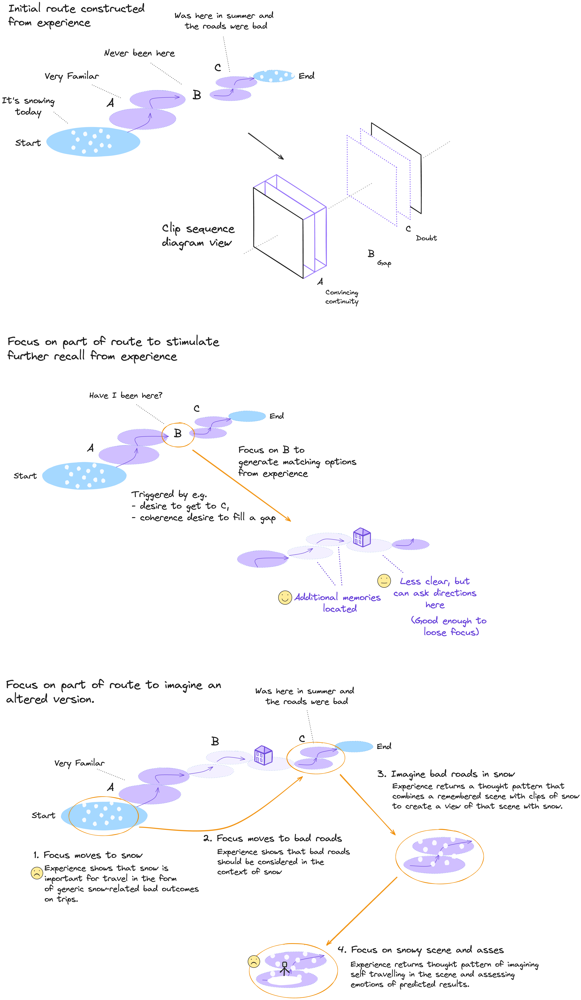
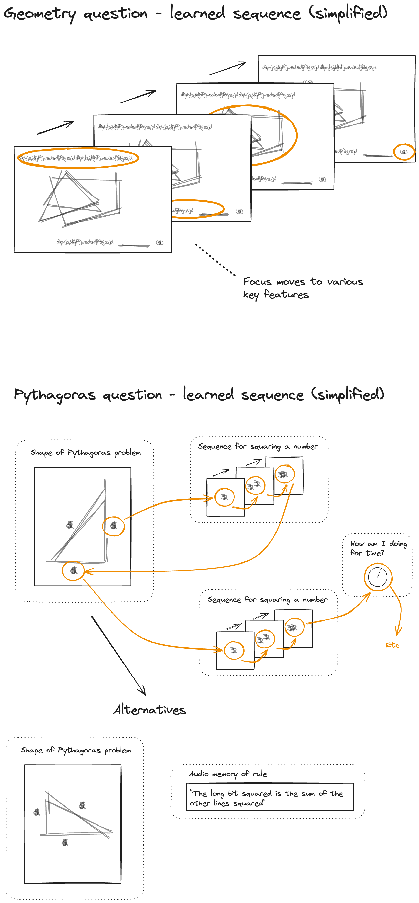
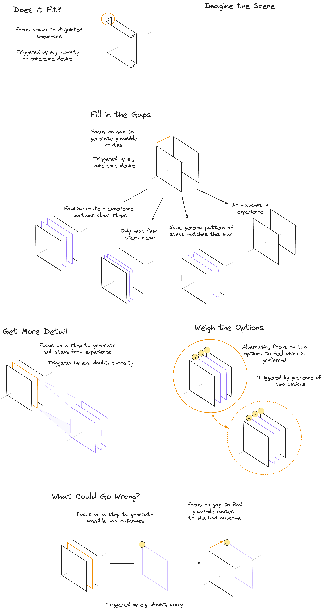

# Illustrated Summary (Draft)

## Core Building Blocks

Cognitive functions in this model will be built entirely from **clips**. Clips can be arranged into **sequences**.

> Note: "Frame" might have been a better word than "clip", but this term is already used in this domain.

### Clips

A clip is a representation of 3D space with a small time component so that movement can be included.

#### Space and Time

#### Ingredients
Clips contain observable phenomena which are represented using particular ingredients. Each ingredient will be handled by a subsystem that specialises in that ingredient, e.g. spatial geometry.

All clips include the emotion of the observer, though this emotion may be neutral.

### Sequences
Clips will be arranged into sequences that depict change over time. This is where temporal concepts such as prediction, causation and provenance will emerge. 

### Composition

#### Clips in Experience

The AI system's experience will include a huge number of sequences that will be used to understand the world and to make plans.

#### Observing the Here and Now

### Recording Experiences

#### Key Features

Features that are not relevant to the context will be readily discarded, such as...

- 

Features may also be highlighted due to their attached emotions, such as...

- Very important things - (fear, desire, ...)
- New or atypical things - (surprise, curiosity, ...)

#### World Model Narrative

## The Thinking Process

### Finding a Route

Most, perhaps all, active thinking is the process of finding a route from one location in space and time to another.

This will be achieved by building sequences that represent these routes.

### Example 1 - Navigation

This example illustrates some of the thinking patterns that may be used when planning a route between locations. It does not include evey step.

### Thoughts as Objects

As can be seen from the example, thinking is a bit like manipulating objects. This is already handled by clips and sequences so the above process can be placed into our existing framework.

### Emotional Guidance and AI Safety

#### ..

#### Illustrative List

Illustrative priming effect of emotions...

* Doubt - to pause, consider and temper other emotions present in a plan.
* Compassion and Empathy - to encourage thoughts of safety and kindness.
* Curiosity - to encourage useful action that is not part of some assigned task.
* Interest - to keep working on something.
* Surprise - to notice significant new information that would benefit from further thought and storage in experience (including new causation / prediction knowledge). 
* Worry - to keep an important matter in mind.
* Urgency - to work faster and use more power.
* Regret - to ponder past actions and build better plans for the future.
* Pride - to create a desire for social approval and for doing a job well.
* Humility - to temper rash confidence.
* Joy, Hapiness etc - Counterparts to worry, regret and other negative emotions.

... and many more. Choices will be made by considering the balance of these emotions for a given situation. There may need to be some that are strongly negative (figuratively speaking) so that, for example, extreme suffering cannot be considered an acceptable tradeoff for a large number of smaller gains. 

#### Defining Emotions

-  A set of very general exemplar sequences will be defined and these will set the emotional goals of the system. Sequences that pattern-match to these core sequences will inherit these emotions according to the degree of similarity.

- This will likely require delicate calibration. It should be possible to author a large set of more specific scenarios in natural language along with expected emotional responses and / or consequent actions. These would be used for testing the system's motivations, including AI safety.

### Example 2 - Pythagoras

If solving a geometry question, then there will be a range of overlapping thought patterns that describe the steps. Our system will return the best matching pattern in any given moment.

### Thinking Patterns

Some of the many thinking patterns include...

## The Self Narrative - Putting it all Together

