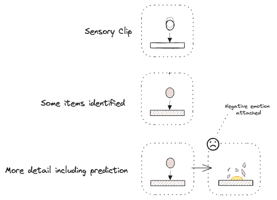
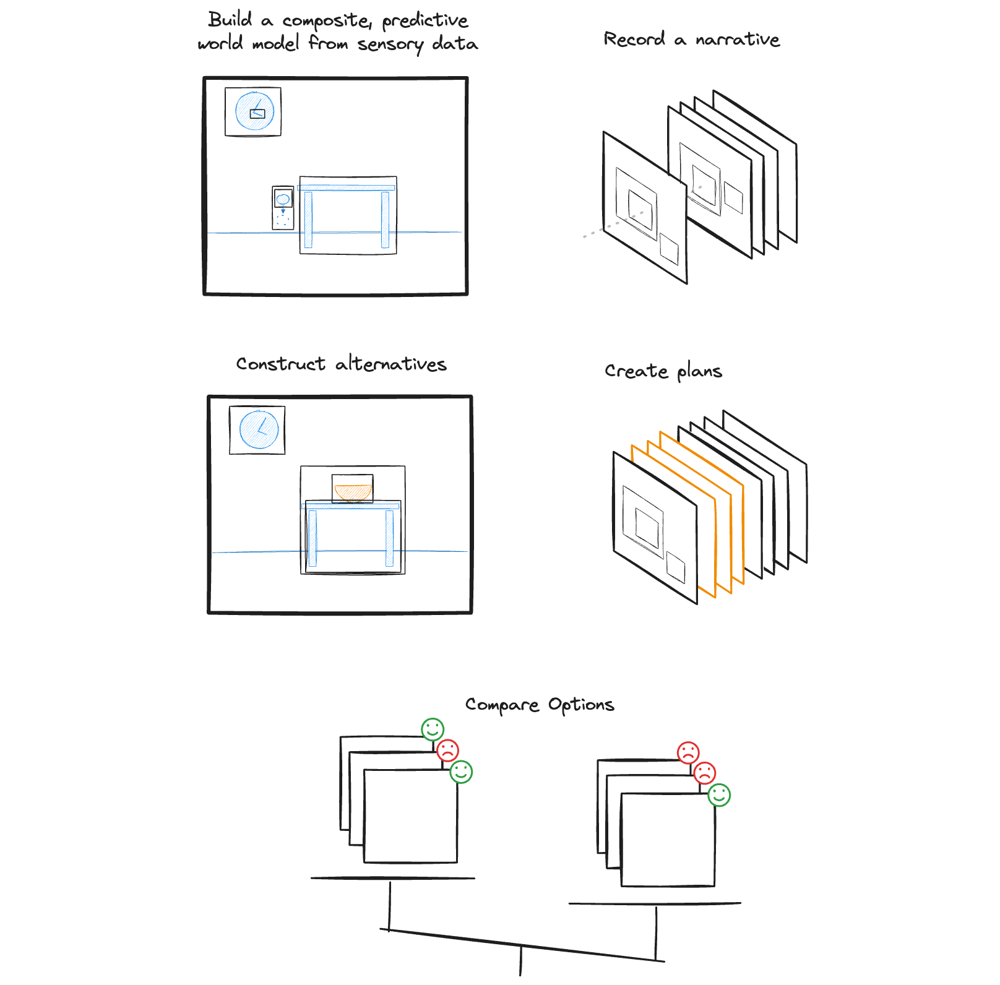

# Imitating Human Cognition in AI Systems

> **Author**: Robert Beckwith
> **Version**: 0.2 - Draft for review

## Summary

This document sketches out a potential cognitive architecture for an AI system that uses a single, albeit complex, datatype. This composable building block combined with several "get next token" loops will be used to generate human-like behaviour and understanding of the world at all levels of detail from catching a ball to high-level procedural reasoning,  ethical decisions and a full episodic history thereof. All actions and thoughts will be steered by emotional priorities that consider the wider picture. Furthermore this building block will be human readable (with suitable tools) and it will facilitate the setting of ethical and other values by incorporating libraries of exemplar scenarios that can be created and discussed in non-technical human terms.

## Introduction

There are a number of issue with current AI systems. There are gaps in their common sense understanding of the world and it is not clear how to guide their choices. This is fundamentally a reliability and trust problem - there is always some chance that they will do something wildly unexpected. 

Here I describe a possible approach to address the above issues via a simplistic model of human thinking that I believe may be 'close enough' to our own thinking to provide the control and transparency that we need. This approach may seem somewhat quaint and akin to designing a flying machine based on bird flight, however unlike the flying machine example,  alignment to human thinking is something of significant value in itself.

At the core of this proposal is a central building block that I will refer to in a deliberately non-technical manner as a 'story' and I will show at a high level how it might be possible to build an artificial human-like mind out of this one building block. This includes flexible reasoning and planning.

A story is similar to a video clip of an event or sequence of events that occur in a three-dimensional environment with motion, interactions, colours, sound and all the sensory ingredients we are accustomed to. A single event is a 'clip' and clips can be composed of other clips. For example, a clip from a tennis match will be composed of clips of tennis balls, rackets, players, grass, sporting competitions, sunlight and so on. A 'tennis ball' is simply a collection of stories about small yellow furry spheres that behave in certain ways and often appear in tennis match stories. A tennis ball clip will itself be composed of other stories about textures, elastic materials, collisions and so on. 

A very important feature of clips is that they present predictions about what will happen next, such as where that tennis ball is likely to go.

A second important feature is that clips include the emotional response of the observer.

The AI system will require a large store of such of stories (experience and knowledge) that it will use to make sense of the world and predict what will happen next. It will also need sensory input (including a 'body'), and active working stories. Some 'get-next-clip' loops will be used to drive the cognitive processing using active working clips as input. Aside from offline reconciliation of experience and peripheral tools, there are no other moving parts.

Ethical values would be set by authoring a large set of scenarios in natural language and assigning them emotional responses. These would then guide the AI behaviour. These values will often conflict in real-world situations and the AI would need to weigh up possible actions much as we do - this would include feelings of doubt. I will focus on the technical ability to do this rather on how we would agree what each scenario's emotional response should be.

As stories are familiar to humans and are used throughout the system it will be possible to get a clear view of what the system is thinking and is likely to do.

>**I don't believe there is any idea here that is new**, though I am not aware of this particular building block being used in this particular way.

>**This is a first pass to illustrate the idea**. Further work would be required to align this with current understandings in neuroscience and to look at technical proofs of concept. 

> **I have deliberately used non-technical language where possible**. A high-level principle is for non-technical people to understand our AI systems. This is nonetheless a fairly technical document due to the subject matter. 

> **This is not a small iteration on transformers or LLMs**. Most current AI systems work with simple data types such as words or pixels.

> **This concerns general purpose reasoning**. It does not cover exotic theoretical physics or software coding, though both of these would, I think, need common sense grounding to be involved in some way.

### Core Principles

> **Alignment with Human Reasoning** - Build AI systems that think in a similar way to humans so that we can understand them intuitively and trust them.

> **Transparency** - The internal workings and current behaviour settings (values) should be visible and understandable to non-technical humans. This will allow wide participation in the setting of ethical values, creation of standards and policies, and individual customisation.

> **Minimalism** - Don't create anything new unless it's absolutely necessary. This is usually wasteful, adds complexity and for those reasons it is unlikely that the human brain would have evolved in such a manner. Optimisations will be deferred as they will likely complicate the picture at this stage.

### Special Features

> **Core Abilities** - This system will have many innate advantages unavailable to humans such as backups, shared experiences, selection of specialist skills, rapid incorporation of new experiences (i.e. not requiring hours of sleep) and the bolt-on tools mentioned below. These can be added without compromising the human-like cognition at the core.

> **Theory of Mind** - This system can be tuned in various ways to produce a variety of thinking styles and personalities for specific settings. This direct experience of different types of thinking could result in much better empathy than is possible for an individual human.

> **Additional Tools** - The system will have direct access to tools such as calendars, schedulers, knowledge sources, calculators, statistical systems, other AI systems (general and specialised), and control interfaces for devices. The interface to these tools will use language and other transparent mechanisms - this will still be orders of magnitude faster than humans accessing equivalent tools.

## Thinking Foundations - Stories as Building Blocks

#### Clips and Sequences

In this discussion I define "stories" as short sequences of events taking place in a three-dimensional space. They will include the physical body of the observer and associated sensations such as touch, proprioception ('muscle' position), pain, hunger and emotional state. They may also include the thoughts of the observer (as stories).

I will split stories into 'clips', 'sequences' and 'narratives'
#### Clips

A clips will show one significant thing in a short time slice. Often there will be some movement or other change that is analogous to motion blur in an animation. The significant thing might be a object or a single event such as a collision or change. It could be a notable absence of any change.

Each clip will have one or more emotional reactions assigned.

> Everything within a clip exists within a three-dimensional space and a slice of time. Nothing can exist outside of this, though the space or time element can be trimmed down so that its presence is minimal.

The most used clips, such as the way that objects fall under gravity, will generally be distilled down to an almost abstract seeming pattern that only contains the essential elements. This will also include common thought patterns ("I should do this first")

#### Sequences

A sequence is a set of clips that follow one another in time. They should blend cleanly into the next clip, though there may be gaps if the next clip clearly follows from the previous clip. For example...

* A set of dominoes toppling (no gaps)
* The main stages in a journey (gaps)

#### Narratives
A set of sequences arranged on a timeline. The timeline may span years.

### Ingredients

Story clips will have a range of *ingredients* described below. These will typically require specialist software behind the scenes.

> There is a balance to be struck between curating these ingredients and allowing the network to discover ingredients by itself - we don't necessarily know what all the human-level ingredients are. Equally, there *may* be some things that are not optional, such as time, causation and three spatial dimensions. Furthermore, uncurated features will be less transparent to humans.

To get things moving, however, we will make the following assumptions...

* **As mentioned earlier, everything within a clip exists within a three-dimensional space and a slice of time. Nothing can exist outside of this.** Contextually unimportant space or time ingredients can be trimmed down or flattened so that their presence is minimal. It may be that all clips can be a moment in time, with or without some motion information and that sequences can encode any longer time span.
* **Causation** may well arise entirely from the handling of sequences and the consistent and ever-present time flow.

In addition to the above, the following ingredients may be present...

* **Sensory Information** - Standard set of human senses including body senses such as proprioception ('muscle' positions), hunger and damage.

* **Emotions**  - Having predicted the likely outcomes, we need to know what is preferred in order to guide AI actions. This will include directing focus to important things. Emotions will be considered part of the physical body so as to avoid adding any new components (minimalism principle). These will esseentially be numbers and we will need a range of different emotions to guide actions in various ways. This will be discussed in more detail later.

* **Visual-Spatial** - Three-dimensional geometry, colours and patterns. This includes movement, surfaces, proximity, physical contact and the layout of surroundings. 

* **Agents and Theory of Mind** - Humans and other creatures, as well as other AI systems, that have inner motives guiding their actions in the world. For humans at least, a sophisticated theory of mind is required, though this is not covered in any detail in this discussion.

* **Location and Situation** - We will need to encode the location and general situation as this will be very important when selecting relevant experiences. It may be that this is an ingredient of clips, or it may be sufficient for the clip storage in experience to be connected to locations and situations. 
Examples include...
	* At home
	* On holiday
	* At Bob's birthday party
	* At the cinema

* **Other Ingredients** There will likely be other required ingredients such as intuitive counting ("there are three lights") and some that might not be required but are useful optimisations (intuitive physics and reading facial expressions might be learnable using the existing ingredients without a dedicated ingredient).

### Building Stories from Stories

> An AI system enters a kitchen and looks around. It hears a noise behind it and looks to see an egg rolling off a table and falling to the ground.

In the above situation, the system must respond to a sound, move its body and focus on the source. It will need to build an understanding of the world as a story using its experience - a large store of stories about the world. This works because stories are composable.

#### Composition

If there is an unmatched object in view that looks eggy or acts eggy then the AI system will be able to add detail to story by replacing "unidentified roundish falling brown thing" with the best matching egg story. This story is now of an egg falling and the next clarification includes a prediction of a mess on the floor and some negative emotion.

This process applies to everything in this story, not just eggs and not just objects. It includes tables, floors, kitchens, cooking, homes, things falling off tables, the sunlight that is illuminating the scene, the shocked face of someone in the room, what happened just before and so on. Many of these stories will include what typically happened next.

These stories will in turn be composed of more fundamental stories - things falling under gravity, smooth surfaces, brittle items, contact and collision and what happens next, shadows on curved objects, and so on.

The AI must find the most relevant stories and so have the best chance of predicting accurately what will happen next. This will be used to guide actions.

#### Distilling Clips to their Essence

These stories in experience should not be full video clips with all details represented. They should only include the key features. This has a number of advantages...

- This saves space by removing unessential details.
- It removes distracting information that would make clips harder to locate.
- Merging a clip into another will be easier as only the key information needs to be adjusted to fit in the current clip and all other details can be incorporated bit by bit from other stories. 
- There is more reuse as a smaller distilled clip is more general and can be used in more situations than a detailed, specific clip.

Key features are the things that made the clip different from other experiences in some important way. This will be affected by the emotional reaction and **novelty** of the clip. (Neural networks are good at this kind of processing.)

#### Distilling Sequences and Narratives

Sequences can be distilled so that only the key events are included, e.g. a conversation at a party could become something close to "Alice said something to Bob who laughed and knocked over a glass".

Key events may include the start and end of a sequence of related events as well as the main things that happened within. These can then be placed in a narrative where the insignificant clips have been removed. 

#### Interpolation

We will use "interpolation" (i.e. filling in the gaps) to save on space and processing. Clips in working memory do not need to be fully resolved unless they become a significant item of focus. If more detail is required then it can be filled in, often using very generic clips.

#### Novelty

An important story quality will be novelty. This will assist with
- The creation of new understandings of interaction and causation when an actual outcome differed from the predicted outcome.
- Bring the focus of attention to important things such as immediate hazards (an unexpected sound) and potentially useful new information (curiosity).
- Evoke feelings of doubt which will be important when making decisions.

Novelty will surface as
- Never encountered - absence of information.
- Infrequently encountered - limited instances.

The above may apply to any aspect of a story, such as...
* An object - e.g. never / rarely seen one of those before.
* A relationship - e.g. never / rarely seen one of these here before.
* An interaction - e.g it's never / rarely done that before.

#### Transparency

Everything in this datatype is something that humans can understand. They could be converted into language, 3D animations or combinations thereof depending on which details are important. Tools would be required that allow humans to query these stories for the interesting sections.

#### Summary

It will be challenging to create a system that can handle this building block, however if this is done then it will allow us to create an entire thinking system that can act in the world and make human-like decisions where...

* **All** knowledge is stored as clips and sequences.
* Narrative history (aka episodic memory) is itself a sequence.
* High-level reasoning (aka System 2) is **entirely** the act of arranging clips into sequences with the guidance of emotions (including doubt, curiosity etc).
* **All** thoughts and physical actions, including the arrangement of clip sequences for reasoning, are are themselves the result of following a clip sequence.

## Thinking Level 1 - The Autopilot

We will use the above mechanisms to create an **Autopilot** for navigating the physical world. This will be able to interact with the physical world (e.g. observe, walk, pick up items) and respond quickly to events. It will not be capable of multi-step planning above this level of detail.

### Location Narrative

Our AI will have a model of what is happening around it - the "here-and-now". The current moment will be a story clip with the AI in the centre and things happening around it in a 3D space. Earlier clips will be retained as a sequence going back in time. The current moment will include a visual field of view and a point of visual focus. As mentioned earlier, body-related senses and current emotions are included.

Our AI will also have a huge store of clips and sequences as experiences that it will use to build its story of the here-and-now from the sensory data it is receiving. There will be two sources of information for the story...

- A stream of sensory data.
- Clarifications from experience.

#### Get Next Clip

We will focus on the second part of the process. For an existing clip of the current moment the AI system will call a 'get-next-clip' function. 

This will take the location narrative as input and return a new clip for the current moment. The old clip will be pushed back into recent history. The input narrative may be distilled such that more trivial events from previous locations are removed.

The new clip will often include an updated clip for the target of focus, and may also include predicted body movements.

#### Priming

The experience clip that is used to clarify the focus subject will be heavily influenced by recent clips in the location narrative, particularly those connected to the current location. This can make a significant difference to the interpretation of surroundings. For example, if our AI system enters a theatre where a Shakespeare play is in progress, then it will expect to see sword fights on stage and understand that they are not real.

The current emotion will likewise prioritise certain clips over others. If fearful, then surrounding features are more likely to be matched to threats. The emotions associated with clips would generally be authored by humans in the first instance to indicate what is important, bad, good and so on.

### Focus and Physical Actions

If there is a subject of visual focus, then the get-next-clip call will find the best match from experience and create a new clip with enhanced detail merged in. This will include a predicted next action for the AI which it will follow. If the item of focus is not of great interest (i.e. the returned clip does not have a strong emotion recorded against it), then the next action will be to focus on another part of the surroundings to build up a general picture.

If an unexpected sound is heard out of view, then the predicted action might be to turn towards that sound and focus on it.

>The turning process will itself be comprised of smaller clips that predict the next body position based on the latest information. This will include proprioception information (muscle position). The AI's body will automatically follow this plan. 

Note that humans  are awake for about six thousand hours per year and constantly filling our experience with such clips during this time. Our AI system will need to be loaded with a high volume of experience to be able to execute all these fine-grained actions.

## Thinking Level 2 - The Auto-Planner

### Building Plans

Planning will be the process of assembling clips together into a sequence that connects one place and time to another such as "here" to "there", "there to somewhere else", "present me" to "future me" and so on. This will require 'thoughts' - speculative clips that are not part of the here and now. As all clips have an emotional marker attached, the plans can be assessed for quality.

Like everything else, plans will be compositional so wider plans will include common sub-steps and so on. For example, when tidying the kitchen, there will be patterns for where any given item should go and the intermediate steps (opening a cupboard door).  Driving a vehicle has many such actions from looking ahead and behind, planning the desired speed, adjusting the controls to meet this, and so on. Many of these will be the usual next step or a short sequence (mirror, signal, manoeuvre). When implementing a plan, there will be a level of detail below which the autopilot can deal with the intervening steps (e.g. walking, picking up objects, changing visual focus etc). 

By not inventing anything new for planning and general thinking (minimalism principle), we are gaining a number of benefits...

- The data type for planning is compatible with the autopilot - they can share data easily.
- We inherit the autopilot abilities in real-world understanding, prediction, transparency, manipulating objects, focus, composition and so on.
- The emotion markers will be critical in assisting with the many micro-decisions that must be made for any activity in a complex world.

The construction of plans will involve pre-existing thought patterns that are triggered in certain circumstances. For example, if completing an actual jigsaw puzzle there are a number of standard and learnable behaviours such as...

- Starting with edge pieces or pieces with more features.
- Knowing how long to look for a piece before giving up and looking for another.
- Knowing how long to look for a piece before checking that it hasn't fallen on the ground.
- Knowing how long to look for a piece before checking that you haven't made an earlier mistake.

These behaviours will not require new structures as we can store all of these as sequences within a narrative history.

### Auto-Planner

> *System 1 does not keep track of alternatives that it rejects, or even of the fact that there were alternatives. - Kahneman, Daniel. Thinking, Fast and Slow*

For the auto planner, we are creating a lightweight process that plans only for familiar situations where the next steps are clear form previous experience such as...

- Driving a car in a familiar location.
- Buying something in a familiar shop.
- Arranging items in their usual neat layout

### The Self Narrative

We will extend the location narrative to include thoughts. We will call this the 'self narrative'. The location narrative now only exists as the autopilot's view of the self narrative. The self narrative will continue to be distilled into the important clips and sequences.

#### Thoughts as Objects

As there are no new ingredients, we will represent thoughts as objects. It will be possible to assemble thoughts like lego pieces to create a plan (i.e. sequence). In addition they could be overlayed onto the here-and-now if required. This ability will build on lower-level abilities in manipulating real-world objects - i.e. there will be less training required for this additional layer if the system can already arrange objects.

For navigation this approach would provide a sense of what lies out of view... 

For manipulating real-world objects it allows ideas to be tested prior to physical action...

  
 

>This may all seem a little inefficient, like sending letters rather than making a phone call, however note the advantages mentioned above and that this solution excludes optimisations. Most of the hard work is happening within and between clips.

#### Get-Next-Clip

Just as the autopilot predicted movement that the AI's motor systems would then follow, the auto-planner's get-next-clip can predict the next step or set of steps based on previous successful thinking patterns in similar situations (i.e. the current priming). 

The construction of novel plans and sequences will be covered in the next section. For now we will assume that a good plan is already available for the situation.

#### Thinking History

The AI's memories will now include what it was thinking and where, for example...

> ... I was approaching a bend in the road and was about to slow down when I heard a loud noise off to the side that reminded me of an accelerating motorbike... 

In theory this can go to an arbitrary depth...

> ... I was at home and feeling happy while thinking about the time when I was feeling nervous at work and thinking about my plan to...

These past events will allow...

* Thoughts to be referred to later and for these earlier thoughts to prime later thoughts and actions. 
* A full diagnostic review by a safety team.
* New sections of the self-narrative to be reviewed and the relevant parts incorporated into experience. This will allow
	* The incorporation of notable plans into future planning strategies (i.e. ones that worked and ones that didn't).
	* Clip novelty to be updated in line with new experiences.
	* The incorporation of local knowledge that is not in general training data.

### The Wandering Mind

If there is no current task that requires planning then the get-next-clip will simply return something relevant to the current situation. This might be something that happened earlier that day for example. The clip after that will then likely be the next clip in a sequence, if there is one, but there may be a stronger match elsewhere - perhaps the current clip is connected to something important that had been put to one side while a more important task was being planned and now there is time to consider this other matter, i.e. a planning sequence might start if this is actionable. 

This is relatively low effort thinking and will be useful for a system with limited power or compute resources. It provides a background review of events to give a wider perspective on priorities.

### Actions

Integration between the auto-planner and auto-pilot is not covered in any detail here. In essence the autopilot's view of the world needs to be embellished with clips that highlight things to obtain or things to avoid. These need to be proximate enough for the autopilot to plan the intervening actions such as walking to a door or reaching for an item.

### Summary

Although this process is procedural in some ways ("do this then do that") there are also things happening that are continuous and blended. The system will be moving and overlaying thoughts onto the here-and-now clip. It will also be linking clips together into sequences that represent journeys and other types of connection in the real world. The "thoughts as objects" paradigm allows both of these types of reasoning to occur together.

## Thinking Level 3 - The Emotional Compass

### Finding Better Solutions

The thinking system above relies on situations covered by general training experience or where such experience can be generalised to a new situation. Some situations may be too novel, however, or require specific knowledge not available in general training. Examples may include specific environments (workplaces, homes etc) where an intelligent system needs to get to know specific people, places and routines. In this thinking level we will add...

- Detection that a plan needs more consideration.
- Construction of alternative plans.
- Deciding between options.
- Considering wider goals and plans.

### Emotions

Emotions are at the core of decision making and their essential purpose is to prime the system for thougths and actions that meet higher-level goals. Whilst these are essentially numbers, it is possible that a wide range of these will be required. Some *illustrative* possibilities are...

* Curiosity - to encourage useful action that is not part of some assigned task.
* Interest - to keep working on something.
* Surprise - to notice significant new information that would benefit from further thought and storage in experience (including new causation / prediction knowledge). 
* Doubt - to pause, consider and temper other emotions present in a plan.
* Compassion and Empathy - to consider safety
* Worry - to keep an important matter in mind.
* Urgency - to work faster.
* Regret - to ponder past actions and build better plans for the future.
* Pride - to create a desire for social approval and for doing a job well.
* Humility - to temper rash confidence.
* Joy, Hapiness etc - Counterparts to worry, regret and other negative emotions.

... and many more. Choices will be made by considering the balance of these emotions for a given situation. There may need to be some that are strongly negative (figuratively speaking) so that, for example, extreme suffering cannot be considered an acceptable tradeoff for a large number of smaller gains. 

> An additional benefit of emotions is to imporove human-machine interactions, therefore there is an incentive to replicate human emotions where reasonable (though there will be some emotions that we will not want to include).

> Of course we don't know what this means in terms of subjective experience for the AI. That is a harder problem and a very important one.

### The Primary Focus

We will add a new focus that will "look at" a target clip, internal or external (the physical metaphor is still in use). If looking at thoughts, then the auto-planner focus will align with this new focus. If looking at the here-and-now, then it will align with and steer the autopilot's focus (usually the visual focus).

The AI system will react emotionally to the target clip. This reaction may be different in the present moment compared to when it was added to experience. Some examples are...

* A usually calm plan is now being made under time pressure.
* An old clip in a sequence is now associated with a new opportunity or risk.
* A comment originally thought to be critical is now understood to be in the context of a friendly joke.

The narrative history now includes this clip and the new emotion for this situation. Furthermore, the emotion will linger for a period of time (depending on the strength and type of emotion). The contents of the target clip and the new emotions that it generates will have a significant effect on priming, and so subsequent thoughts and thought patterns will be strongly affected, i.e. the auto-planner will produce clips related to the target item rather than moving on with a single next step. 

>Emotions will steer the auto-planner into new territory.

>Strong emotions will result in a faster production of ideas and a corresponding greater quantity of ideas in working memory.

The prediction of the next target for the primary focus may work best in a separate loop from the get-next-clip calls so that the autopilot and auto-planner can produce next clips independently.

#### Building Sequences

The general process for this level of plan building is to examine the options in more detail to see if they fit well. For example, if looking for a plan to get from A to B where A and B are clips in working memory, the focus might settle on a sequence with a missing clip: `A -> ? -> B`. It might do this because `B` is very important and therefore attracted attention of the primary focus. The primed auto-planner will then return a candidate connecting clip based on similar situations. Focus can move to this connection and assess it for suitability. Some example assessing patterns are...

**Experience the clip in the current context...**
- **Novelty** - is this familiar or new?
- **Risk** - a feeling of risk will prime for a possible bad outcome. The thought pattern here may be to hold this feeling to generate a number of bad outcomes which can in turn be tested for likelihood by using this same mechanism - i.e. try to build a sequence from the plan to the bad outcome.

**Experience the sequence in the current context**
- **Continuity** - do the clips flow or are they disjointed.

**Experience two options in the current context**
* **Compare** - hold options in working memory and shift focus between them to feel their relative emotional status.

**Generate more detail**
* **Sub-Plans** - focus on the candidate clip with a curiosity emotion and so prime the auto-planner for sub-plans which can then be assessed.
* **Provenance** - generate likely precursor narratives to assess the reliability of current information

As with the auto-planner, the selected assessing pattern will be based on what worked best in previous similar cases. This is essentially the same mechanism that was used for training the autopilot to interact with the physical world.

>**Throughout this process there is a constant balance of overall priorities**. Some of these will have a wider scope, for example
>- What level of risk is acceptable to proceed with this plan? 
>- This person is waiting for an answer.
>- How long should I think about this? 
>- I should get on with that other task and do this later.

This activity is clearly more processor intensive and more information must be held in working memory.

#### Mixed Feelings

The clips in a sequence may have conflicting emotions. These could be played in quick succession to provide an overall experience of these emotions. Here is an illustration of how this might work behind the scenes...

#### Language

The clips, sequences, thoughts, emotions and planning processes would need to be describable in language so that the AI system can communicate with humans. It will also be necessary to allow experience, especially alignment-related experience, to be authored in natural language.

Language may also be an economical way to encode thinking patterns or create plans in the moment (e.g. "so first I'll do this and then I'll do that"). As things stand, this would need to use an existing ingredient such as sound.

Like everything else here this part needs much more analysis though it feels achievable in principle.

Some initial illustrative thoughts are...

- Nouns will map to the archetypal clips of the corresponding object.
- Transitive verbs will typically map to interaction / causation events.
- Various tenses and subjunctives will map to planning patterns.

### Summary of Key Features

The key features of this process are
- The ability to generate multiple guiding steps to some end goal and assess the value of choices in finer detail that a single instinctive judgement would allow.
- The ability to set up, use and refine thinking patterns for later use.
- The ability work with thoughts from different settings such as the future, the past, plans for other people and fictional narratives, and to connect these settings - future self goals, where did that come from, how do I get home etc.
- The ability to create new stories.
- A fine-grained emotion-driven process that may be a good model for truly autonomous systems acting in a complicated world.
- All these patterns can be inspected and authored by humans.
- The additional tools and capabilities mentioned in the introduction would significantly boost the speed and accuracy of this process.

## Consolidating Experiences

Something akin to sleep could be used to consolidate a section of the self-narrative (e.g. one day) into general experiences. This could perhaps be done offline and the resulting weights downloaded by the AI system. The consolidation process would...

- Assess the day's events and emotional moments for significant knowledge. 
- Add key stories to general experience having removed any internal thoughts that would distract the autopilot.
- Identify and store the key thinking patterns.
- Update the level of novelty for key events.
- Prepend a distilled self-narrative into a long term narrative store.

If required, then this process could also distribute emotional reactions from core exemplar scenarios to more specific clips and sequences to guarantee that these emotions will surface in the relevant circumstances.

## Training Challenges

There are many unanswered questions with respect to training. Some initial thoughts are:

* The story data type is very complex - much more so that text or pixels. A hierarchy of processing may be helpful so that aspects such as geometry can be handled first. Ultimately it seems that there must be a neural network somewhere that can handle the full story data type (there may be a way around this however). If this data type changes, e.g. to incorporate a new ingredient, then it may be necessary to fully retrain this part of the system. 

* As previously mentioned, there is a balance to be struck between curating the data type and allowing the network to discover ingredients by itself - we don't necessarily know what all the human-level ingredients are. Equally, there may be some things that are not optional, such as time and three spatial dimensions.

* The recursive nature of thoughts-as-objects may be very challenging, thought if there is a solid grounding for real-world objects then it is *possible* that this level may be relatively easy.

* It may be that after some level of training has occurred, a vast set of knowledge can be added more easily via text. This would include thinking patterns.

* The story type would likely need an embedding representation of some sort for the self-narrative and working memory.

* Simulation will be a key tool, particularly for thoughts-as-objects.

* Prototype versions would not require the full set of sensory ingredients.

There is some potential to use an LLM to test the planner logic. This might involve, for example, planning a route via various streets each of which has some associated emotional rating.

## Related Technologies

A separate document is in progress on related technologies. These include...

* **Scenario Database (SDB)** - A database of scenarios with a story-based query language. This may be useful for curating exemplar scenarios and for navigating other AI risks (e.g. "who guards the guards").
* **Levels of Truth** - A knowledge source with emotions such as doubt and uncertainty baked in. This might be useful for representing multiple perspectives.
* **Superintelligence** - A superintelligent AI does not need to be good all types of thinking. With the above architecture, much of the reasoning and intuitions about geometry, maths and so forth are *within* a clip. If these abilities were superhuman, but the processing of clips and sequences was poor, then the system could have incredible insights into maths and physics but perform less well than a typical human on a simple shopping trip.  Conversely, a network of human-like systems could form a logistical powerhouse spanning the world but remain human-level at each node. 

## Closing Remarks

> *"All models are wrong, but some are useful"*

Is it possible to build a human-style mind using the machinery of a simpler type of mind? Can it be turtles all the way up? This proposal needs more investigation and proof of concept projects to see if it really hangs together. 

I feel that the benefits are such that this warrants further study.  Our future ecosystem of AIs would be much improved by a familiar human-like presence in the mix. It may be possible to create meaningful regulations and ultimately trust these systems.

## References

* Thinking, Fast and Slow - *Kahneman, Daniel*. 
* Prolegomena to Any Future Metaphysics - *Kant, Immanuel*
* Human Intelligence: Insights from Infants (YouTube) - *Spelke, Elizabeth*
* Robert Miles AI Safety (YouTube) - *Miles, Robert*
* Atlas of the Heart - *Brown, Brené*

