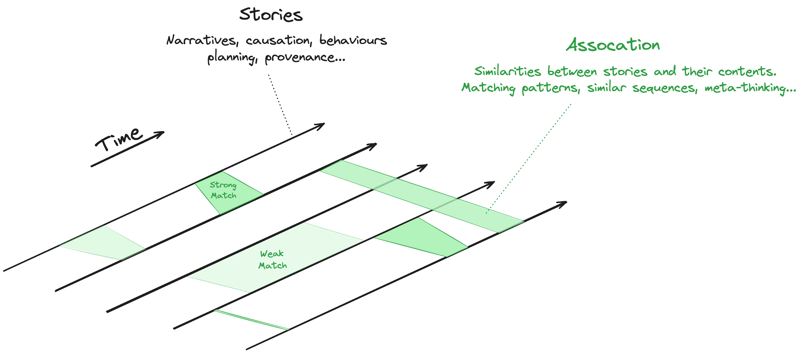
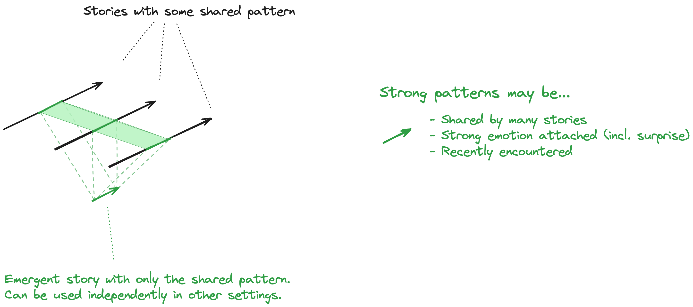
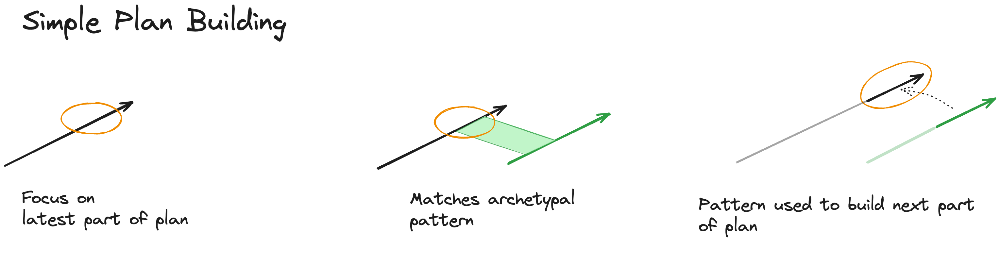
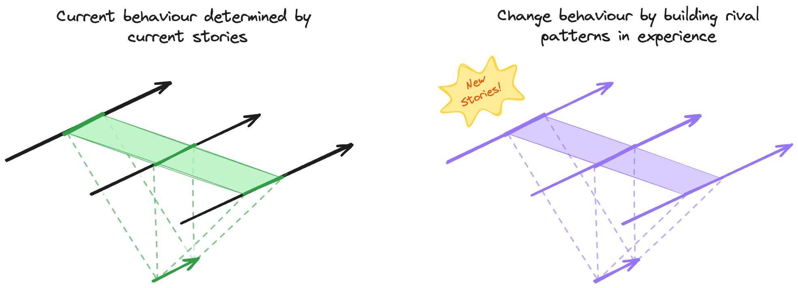
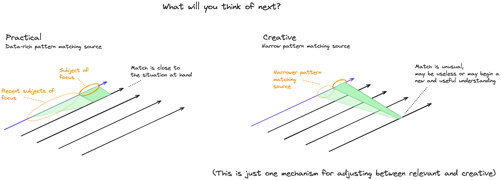

# Human Cognition in Pictures

Author: Robert Beckwith
 
Version: pre-draft

//todo - settle naming conventions.

This document presents a view on human cognition. This is an initial sketch to encourage feedback with the hope that this could become a useful framework for thinking about human thinking and potentially other sorts of thinking. It is not intended to be a comprehensive description - complex problems do not usually have simple answers.

This view of cognition is divided into two key parts...

* **World Model** - our internal model of the world and ourselves.
* **Value Assessment** - our value judgement of what we perceive in the model i.e. how we feel about it.

## World Model

### Stories and Association

The information in this world model is in the form of **stories** - temporal sequences of the form "_this, then that, then that_". We use these to predict, plan and generally understand the world. Each moment in a sequence is built from certain "ingredients of understanding" such as 3D geometry and colours.

The primary activity of our minds is the process of finding shared patterns between these stories. It is this lateral associative activity that weaves the story threads together into a complete information model somewhat like the warp and weft of a tapestry.

 

 

Examples of stories include...

* We way that water drops flow down a window pane
* That time you accidentally threw a ball though Mr Smith's window
* The typical process for boarding an aircraft
* Your childhood
* The sensations felt when having a cold drink on a hot day
* Ideas about the future of humanity
* How objects fall and bounce
* The opening bars of a song

 
 _**The model includes how you feel or felt about these things**_

## Stories
### Story Ingredients

> **Terminology Note:** Similar terms include _templates_ and _categories of understanding_

 

 
Story Sequences

todo

## Association

### Matching on Story Patterns

The knowledge encapsulated by association is an essential component in thinking...
 

 
It will be used when constructing narratives as it allows past experience to be applied to new but similar situations.

Strong patterns may be...
* Shared by many stories
* Have a strong emotion attached (including surprise)
* Recently encountered

 

### Simple Plan Building

When we are planning, the next option that comes to mind will be based on association with previous experience. A simple example of this is as follows...

 

The matching story will be based on...

* Similarity of the source patterns.
* Current emotions (e.g. if currently fearful then different thoughts will arise compared to when feeling secure).
* Recent thoughts (priming)

Examples include...

* Commonly encountered objects (cars, eggs, houses ...)
* Common activities (walking, crossing the road, preparing breakfast ...)
* Common thinking patterns (adding a list of numbers, choosing )

### Lenses on Life

The above mechanism will affect what we notice in the complex world of our environment and our thoughts.

### Creativity

### Changing Behaviour

todo

### Example of Relevant vs Creative Thinking

As an example, we could say that one mechanism for adjusting the level of creativity of the next occurring thought is the amount of data that we use as a source when looking for a matching pattern...
 

 

## Feelings and Value Judgements

todo

### Focus of Attention

### Slow Thinking

* Small focus for targeted assessment
* We experience things in sequence
* Holding focus to stimulate additional options
* Slow thinking patterns

### Levels of Evaluation

### Storing Evaluations

