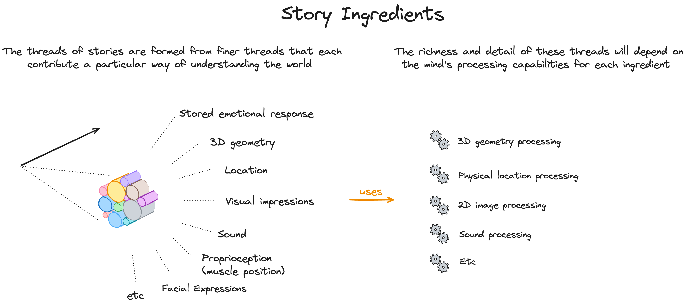
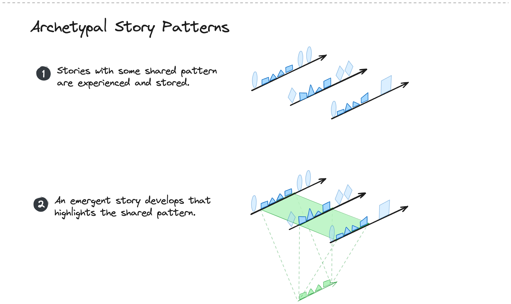
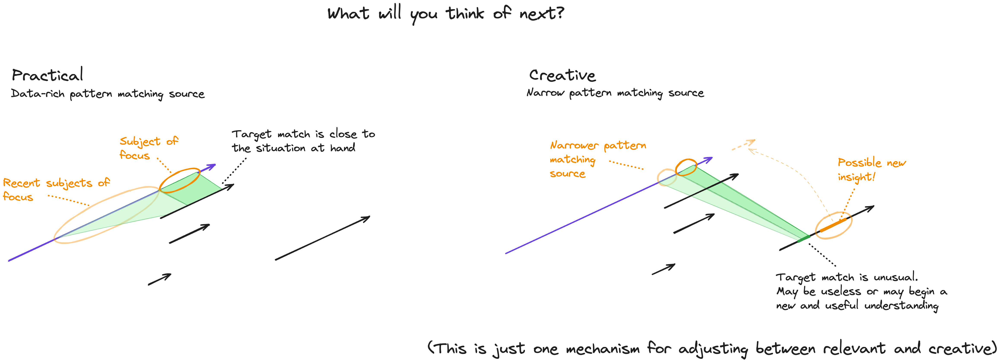

# Reasoning in Pictures

Author: Robert Beckwith
 
Version: pre-draft

//todo - settle naming conventions.

## Stories and Association - The Warp and Weft

This proposal presents thinking as a weave of stories and associative connections between stories, much as tapestries are woven from a "warp" and cross-cutting "weft".

The warp can be seen as narrative knowledge "this, then that, then that" - temporal sequences that we use to predict, plan and generally understand the world. These will be called 'stories" in this document.

The weft can be seen those things that stories have in common, i.e. similar patterns. These will be called "associations" in this document.
 

## Story Ingredients
 

 
## Story Sequences

todo

## Associative Knowledge

The knowledge encapsulated by association is an essential component in thinking...
 

 
It will be used when constructing narratives as it allows past experience to be applied to new but similar situations.
 

 
Examples include...

* Commonly encountered objects (cars, eggs, houses ...)
* Common activities (walking, crossing the road, preparing breakfast ...)
* Common thinking patterns (adding a list of numbers, choosing )

## Example of Relevant vs Creative Thinking

As an example, we could say that one mechanism for adjusting the level of creativity of the next occurring thought is the amount of data that we use as a source when looking for a matching pattern...
 

 
