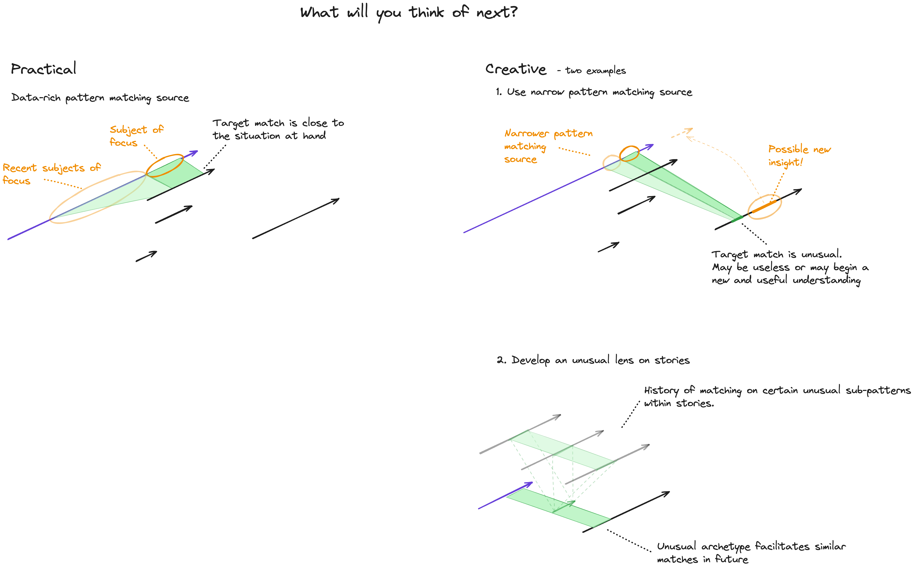

# Weaving Analogy for Thinking

## Warp and Weft
A possibly useful metaphor for one aspect of thinking is via weaving. Tapestries are woven form the warp and the weft - perpendicular threads that interlock to bind the whole tapestry together.

The warp can be seen as narrative knowledge - temporal sequences that we use to predict, plan and generally understand the world. The weft can be seen as knowledge of the properties of things and how they are similar or dissimilar.

## Example of Relevant vs Creative Thinking

As an example, we could say that one mechanism for adjusting the level of creativity of the next occurring thought is the amount of data that we use as a source when looking for a matching pattern...

